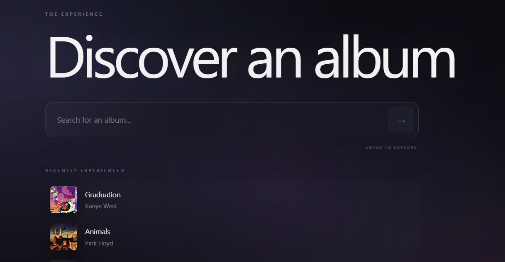
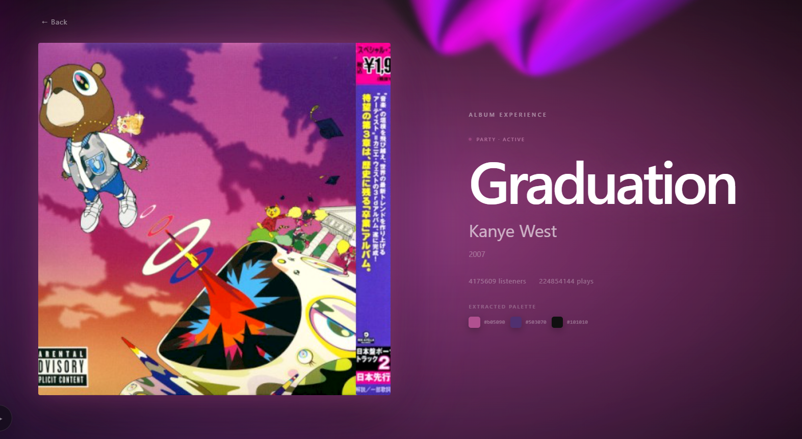
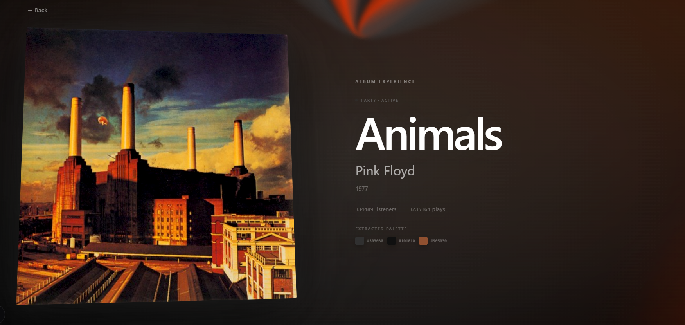
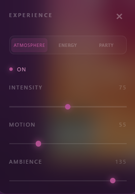
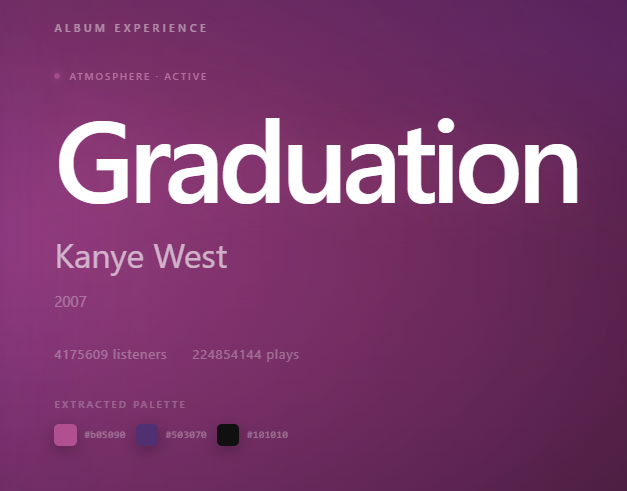

# TheExperience

**TheExperience** is an interactive music discovery and visual experience application built around a simple idea:

> **Choose an album. Extract its colors. Turn them into an experience.**

The application combines music metadata, popularity data, album artwork, image analysis, and a custom lighting engine to transform album artwork into an interactive visual environment.

## Engineering Article

I wrote about the backend architecture and engineering decisions behind the multi-source music discovery pipeline:

📖 **[Building a Fast Multi-Source Music Discovery Pipeline with FastAPI](https://dev.to/nidhaldal/building-a-fast-multi-source-music-discovery-pipeline-with-fastapi-3ai5)**

## ✨ Experience

TheExperience has two frontend implementations sharing the same FastAPI backend:

* **Angular** — the first implementation and architectural foundation.
* **React + TypeScript** — the primary polished experience and current frontend focus.

The React experience takes an album from search to visualization:

```text
Album Search
     ↓
Last.fm
     ↓
MusicBrainz enrichment
     ↓
Album artwork
     ↓
Color extraction
     ↓
Dynamic visual theme
     ↓
Lighting engine
     ↓
Interactive album experience
```

## Features

### 🔎 Music Discovery

* Album search with autocomplete
* Keyboard navigation
* Search result ranking
* Recent album history
* Album metadata enrichment
* Matching results across multiple music sources

### 🎨 Album Color Intelligence

Album artwork is analyzed directly in the browser to extract a visual palette consisting of:

* Dominant color
* Secondary color
* Accent color

The extracted palette is then used throughout the experience to influence the interface and lighting system.

### 💡 Visual Lighting Engine

The album palette drives a custom CSS-based lighting system designed to make the screen itself behave like a light source.

Available modes include:

* **Atmosphere** — slow, cinematic ambient movement
* **Energy** — more dynamic stage-style lighting
* **Party** — high-energy beams, floods, color hits and strobe effects

The experience also includes controls for:

* Lighting mode
* Intensity
* Motion
* Ambience
* Light enable/disable

The lighting system is intentionally separated from the color extraction layer so that it can eventually support additional outputs such as physical LEDs or external lighting devices.

### 🖥️ Interactive UI

* Dynamic UI theming based on extracted album colors
* Interactive 3D album artwork
* Animated experience transitions
* Glassmorphism-style controls
* Responsive layouts
* Recent album interactions
* Reduced-motion support
* Keyboard-accessible album search

## Tech Stack

### Frontend

#### React Experience

* React
* TypeScript
* Vite
* CSS animations and transitions
* React Hooks
* Browser Canvas API

#### Angular Experience

* Angular
* TypeScript
* RxJS
* Standalone Components
* CSS animations and transitions

### Backend

* Python
* FastAPI
* Pydantic
* Asynchronous HTTP API integration

### External APIs

* Last.fm — music search and popularity data
* MusicBrainz — music metadata and release information
* Cover Art Archive — album artwork

## Performance & Engineering

The backend was designed to keep search lightweight while reserving deeper
API enrichment for album selection.

### Search

* Last.fm is used as the primary search provider.
* Autocomplete avoids MusicBrainz and Cover Art requests.
* Search results are cached for 5 minutes.
* Cached searches return in approximately 0.00s in local testing.
* Uncached Last.fm searches typically complete in under ~1.5s in local testing.

### Album Enrichment

Selecting an album triggers deeper metadata enrichment:

```text
Last.fm popularity ──────┐
                         ├── Concurrent requests
MusicBrainz metadata ────┘
             ↓
        Cover Art
```

## Experience Preview

TheExperience turns an album into a visual experience driven by its artwork and extracted color palette.

### Discovery

Search for albums and revisit recently experienced albums directly from the discovery screen.



### Album Experiences

Each album generates its own visual environment based on its artwork and extracted colors.

**Graduation**



**Animals**



### Lighting Controls

Switch between different lighting modes and control the intensity, motion, and ambience of the experience.



### Album Information & Color Extraction

The experience exposes the album's metadata alongside the extracted visual palette used by the lighting engine.




## Architecture

The project uses a shared backend with two independent frontend implementations.

```text
                    ┌──────────────────┐
                    │   React Frontend │
                    │  Visual Experience│
                    └────────┬─────────┘
                             │
                    ┌────────▼─────────┐
                    │ Angular Frontend │
                    │ Discovery / UI   │
                    └────────┬─────────┘
                             │
                             ▼
                    ┌──────────────────┐
                    │    FastAPI API   │
                    └────────┬─────────┘
                             │
                 ┌───────────┼───────────┐
                 ▼           ▼           ▼
             Last.fm    MusicBrainz   Cover Art
                                      Archive
                             │
                             ▼
                    Merged Album Data
                             │
                             ▼
                    React Visual Layer
                             │
                    ┌────────┴────────┐
                    ▼                 ▼
              Color Engine      Lighting Engine
```

## Project Structure

```text
theexperience/
│
├── backend/
│   ├── app/
│   │   ├── routers/
│   │   ├── schemas/
│   │   ├── services/
│   │   └── main.py
│   │
│   └── tests/
│       ├── unit/
│       └── integration/
│
├── frontend/
│   └── Angular application
│
├── react-frontend/
│   ├── src/
│   │   ├── components/
│   │   ├── hooks/
│   │   ├── services/
│   │   ├── types/
│   │   └── utils/
│   │
│   └── Vite configuration
│
└── README.md
```

## API Flow

The backend separates album discovery from album enrichment.

### Search & Autocomplete

```text
Search / Autocomplete
        ↓
      Last.fm
        ↓
Lightweight album results
```

## Color Extraction

Album artwork is processed client-side using the browser's Canvas API.

The extraction pipeline:

```text
Album Artwork
     ↓
Canvas
     ↓
Pixel Sampling
     ↓
Color Quantization
     ↓
Dominant Color Ranking
     ↓
Palette Selection
     ↓
Visual Experience
```

The extracted palette is shared with the visual layer through CSS custom properties, allowing the interface and lighting engine to react to the selected artwork without introducing a large styling or state-management dependency.

## Engineering Focus

The project is intentionally built without a large UI or animation framework.

The visual system is primarily composed from:

* React state and hooks
* CSS custom properties
* CSS animations
* CSS gradients
* CSS transforms
* Canvas-based image analysis
* A small custom lighting engine

This keeps the visual behavior controllable while making the underlying implementation easy to understand and extend.

## Testing

The backend contains unit and integration test structure.

The Angular implementation also includes component/service tests covering the main discovery flow.

The React implementation is currently focused on the interactive visual experience and frontend architecture.

## Project Status

**Active development.**

The core discovery pipeline and React visual experience are functional.

Current completed areas include:

* Music discovery
* Multi-source metadata integration
* Album artwork retrieval
* Album matching and normalization
* Color extraction
* Dynamic UI theming
* Custom lighting modes
* Interactive experience controls
* Recent album history
* Responsive frontend behavior

### Next

Potential future development includes:

* Audio-reactive lighting
* Track-level music integration
* Beat/bass detection
* More advanced color analysis
* Physical LED / smart-light output
* Improved recommendation systems

## Why Two Frontends?

The project deliberately contains both Angular and React implementations.

The Angular application served as the initial implementation and helped establish the application's API integration and discovery architecture.

The React implementation is the current flagship experience, allowing the same backend and data pipeline to power a more interaction-heavy visual frontend.

This also provides a direct comparison of how the same product architecture can be expressed across two modern frontend ecosystems.

## License

This project is currently a personal portfolio project.
